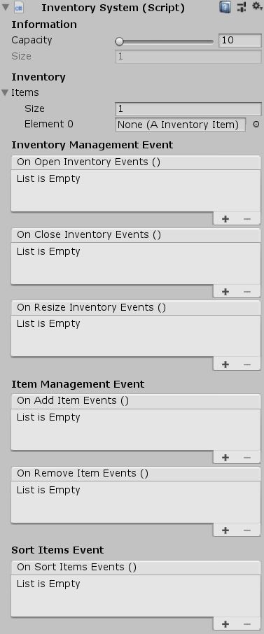

# Unity-Inventory-Mechanism

Module to replicate the behaviour of an inventory in Unity3D

*Can be attach with Component --> UniCraft --> InventorySystem*

# Features

Inventory Management

    - Open
    - Close
    - Resize

Item Management

    - Add
    - Remove

Research

    - Contains
    - Find item by name
    - Find all item by name
    
Sort

    - Sort items by name (Ascending or Descending)

Actions can be added on every events

Can be edited on multiple objects

# Information

Tested on Unity **2018.3.0b**

Version **1.0**

# Screenshots

# License

MIT License